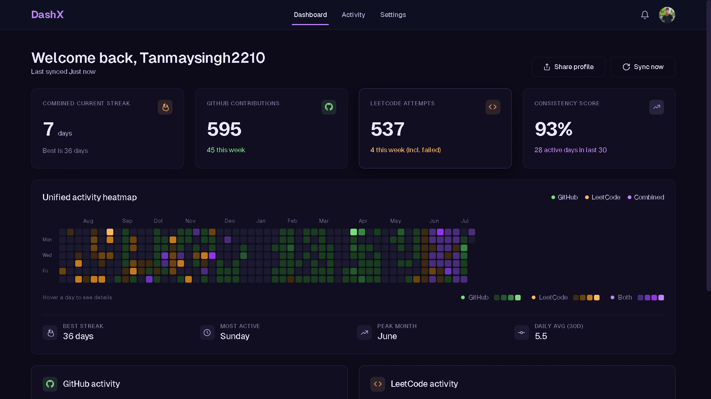
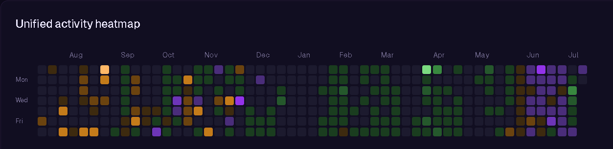
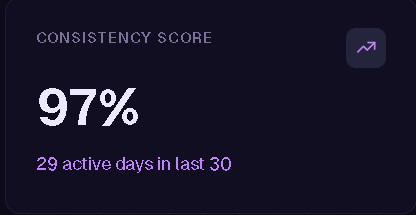
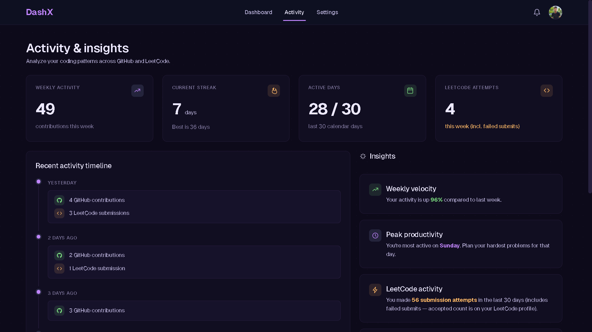

<div align="center">


# DashX

### Developer Intelligence Platform

## Measure Engineering Consistency Across Coding Platforms

A modern developer profile that combines **GitHub** and **LeetCode** into a unified experience, helping developers showcase continuous growth instead of isolated platform activity.

<br>

<p>

<a href="https://dashx.aalsicoders.in">

</a>

<a href="https://dashx.aalsicoders.in/u/Tanmaysingh2210">

</a>

</p>

<br>

> **"Because developer growth shouldn't be measured by one platform."**

</div>

---

# ✨ Experience DashX

> **Everything you need to understand a developer's journey—on a single dashboard.**

<p align="center">

</p>

<br>

<table>
<tr>

<td width="33%" align="center">

### 🌈 Unified Heatmap

Track project development and problem-solving together on one timeline.



</td>

<td width="33%" align="center">

### 📊 Developer Consistency Index

Measure engineering consistency over time instead of relying on isolated platform activity.



</td>

<td width="33%" align="center">

### 📈 Weekly Insights

Understand progress through weekly comparisons, productivity trends, and coding habits.


</td>

</tr>
</table>

---

# 💡 The Story Behind DashX

DashX started with a simple observation during my own learning journey.

Whenever I was building a project, I spent days writing code, fixing bugs, designing features, and shipping updates. During those periods, my GitHub profile remained highly active while my LeetCode profile appeared almost inactive.

Once the project was complete, I naturally shifted my focus towards Data Structures and Algorithms. My LeetCode activity increased significantly, while GitHub contributions slowed down.

Although I was coding every single day, neither platform accurately reflected my consistency.

Someone looking only at GitHub or only at LeetCode could easily assume I wasn't actively improving.

That became the motivation behind DashX.

---

# 🚨 Why DashX?

Recruiters often evaluate developers by checking GitHub and LeetCode separately.

The problem is that software engineering doesn't happen on a single platform.

Developers constantly switch between building real-world applications and practicing algorithms depending on what they're currently learning.

As a result, their engineering journey becomes fragmented across multiple platforms.

DashX solves this by combining coding activity into one unified developer profile, helping recruiters evaluate **overall engineering consistency** instead of isolated platform statistics.

---

# ⭐ Signature Features

DashX is built around four core capabilities that define the platform.

---

## 🌈 Unified Activity Heatmap

Unlike traditional contribution calendars, DashX merges GitHub development and LeetCode problem-solving into a single activity timeline.

Every day you code contributes to one unified engineering journey.

---

## 📊 Developer Consistency Index (DCI)

The Developer Consistency Index measures how consistently you've been active over the last 30 days.

Instead of rewarding occasional bursts of activity, DCI emphasizes sustained engineering effort.

---

## 🔥 Combined Coding Streak

DashX maintains one streak across supported coding platforms.

Whether you're shipping features or solving algorithms, every productive day counts.

---

## 📈 Weekly Performance Insights

Track progress week over week through productivity trends, coding habits, and personalized insights.

Stay motivated by understanding how your engineering consistency evolves over time.

---

# 🛠 Built With

<table>
<tr>

<td align="center" width="25%">

<a href="https://react.dev">


### React

Modern frontend library

</a>

</td>

<td align="center" width="25%">

<a href="https://expressjs.com">


### Express.js

Backend Framework

</a>

</td>

<td align="center" width="25%">

<a href="https://www.mongodb.com/docs/">


### MongoDB

Document Database

</a>

</td>

<td align="center" width="25%">

<a href="https://www.passportjs.org/">


### GitHub OAuth

Passport.js

</a>

</td>

</tr>

<tr>

<td align="center">

<a href="https://graphql.org/">


### GraphQL

Query Language

</a>

</td>

<td align="center">

<a href="https://recharts.org/">


### Recharts

Charts & Analytics

</a>

</td>

<td align="center">

<a href="https://reactrouter.com/">


### React Router

Client Routing

</a>

</td>

</tr>

</table>

---

# 🎯 Vision

DashX is being built to become the **central developer profile** that represents a developer's complete engineering journey.

The long-term vision is to support platforms such as **TryHackMe**, **Codeforces**, **CodeChef**, **HackerRank**, **GeeksforGeeks**, and many others while leveraging **Machine Learning** to provide personalized insights, productivity analysis, and developer growth recommendations.

---

> ### "Developer consistency shouldn't be measured by one platform. It should be measured by the entire engineering journey."

# 🌟 What Makes DashX Different?

DashX isn't another GitHub analytics dashboard.

It was built around one simple belief:

> **A developer's consistency should be measured across their entire engineering journey—not by a single platform.**

Instead of treating GitHub and LeetCode as separate achievements, DashX combines both into one meaningful developer profile.

Whether you're building production-ready applications or solving algorithmic problems, every effort contributes to your overall consistency.

---

# ⚡ Feature Highlights

<table>

<tr>    

<td width="50%">

## 🔥 Unified Developer Profile

Track your engineering journey across multiple coding platforms from a single dashboard.

No more switching between GitHub and LeetCode.

</td>

<td width="50%">

## 📅 Combined Heatmap

A unique activity heatmap that merges project development and problem-solving into one visual timeline.

Understand **how consistently you've been coding**, regardless of the platform.

</td>

</tr>

<tr>

<td>

## 📈 Developer Consistency Score

Measure how consistently you've been active over the last 30 days.

Instead of tracking isolated streaks, DashX evaluates your overall engineering discipline.

</td>

<td>

## ⚡ Combined Coding Streak

Building projects and solving coding problems both contribute towards maintaining your streak.

Because consistency isn't platform-specific.

</td>

</tr>

<tr>

<td>

## 📊 Weekly Progress Insights

Compare your activity against previous weeks.

Stay motivated by understanding whether you're improving, slowing down, or maintaining your momentum.

</td>

<td>

## 🎯 Personalized Insights

Discover your:

- Most productive day
- Peak coding month
- Daily average
- Weekly velocity
- Active day percentage

</td>

</tr>

<tr>

<td>

## 🔄 One-click Sync

Instantly refresh your analytics and fetch the latest GitHub and LeetCode activity.

</td>

<td>

## 🌐 Public Developer Profile

Share a beautiful public profile that highlights your engineering consistency.

Perfect for resumes, portfolios, and LinkedIn.

</td>

</tr>

</table>

---

# 📸 Product Walkthrough

<table>

<tr>

<td align="center">

### Dashboard


</td>

</tr>

<tr>

<td align="center">

### Activity Timeline



</td>

</tr>

<tr>

<td align="center">

### Unified Heatmap


</td>

</tr>

</table>

---

# 🎯 Why Recruiters Love DashX

Traditional developer profiles require recruiters to inspect multiple platforms individually.

DashX simplifies this process by presenting a unified view of a candidate's engineering journey.

Instead of asking:

❌ *"Why is this developer inactive on GitHub?"*

DashX answers:

✅ *"This developer spent the week solving algorithmic problems while maintaining overall coding consistency."*

Similarly,

❌ *"Why is LeetCode inactive?"*

becomes

✅ *"The developer was shipping features and building real-world projects."*

This results in a fairer and more accurate representation of developer growth.

---

# ⚖️ DashX vs Traditional Profiles

| Traditional Workflow | DashX |
|----------------------|--------|
| Check GitHub separately | ✅ Unified Developer Profile |
| Check LeetCode separately | ✅ Combined Analytics |
| Guess coding consistency | ✅ Developer Consistency Score |
| Separate contribution history | ✅ Unified Activity Heatmap |
| Different streaks | ✅ Combined Coding Streak |
| Manual evaluation | ✅ Actionable Insights |

---

# 💎 Design Philosophy

DashX follows a simple design principle:

> **Less clutter. More meaningful insights.**

Instead of displaying dozens of disconnected statistics, every chart, score, and visualization is designed to answer one question:

**"How consistently is this developer growing?"**

Every feature exists to support that goal.


# 🏗 Engineering Behind DashX

DashX isn't just a dashboard that displays statistics.

Every insight shown on the platform is generated through a structured processing pipeline that collects, normalizes, analyzes, and visualizes developer activity across multiple coding platforms.

---

# 🔄 How DashX Works

```text
                          GitHub
                    (GraphQL API)
                           │
                           │
                           ▼
                   ┌────────────────┐
                   │                │
                   │                │
                   │                │
                   │                │
                   │                │
LeetCode           │ Developer      │
(GraphQL API) ───► │ Intelligence   │
                   │ Engine         │
                   │                │
                   │                │
                   └────────────────┘
                           │
                           ▼
                     MongoDB Cache
                           │
                           ▼
                   Express REST API
                           │
                           ▼
                    React Dashboard
```

---

# 🧠 Developer Intelligence Engine

At the heart of DashX lies the **Developer Intelligence Engine**.

Instead of simply displaying raw GitHub and LeetCode statistics, DashX transforms platform-specific activity into meaningful developer insights.

The engine is responsible for:

- 🌈 Generating the Unified Activity Heatmap
- 📊 Calculating the Developer Consistency Index (DCI)
- 🔥 Maintaining the Combined Coding Streak
- 📅 Building Activity Timelines
- 📈 Generating Weekly Progress Reports
- 📉 Producing Productivity Insights

Every metric displayed on DashX is generated by this processing engine.

---

# ⚙ Engineering Challenges

Building DashX required solving several non-trivial engineering problems.

### 🌈 Unified Activity Heatmap

GitHub and LeetCode expose activity using completely different data structures.

DashX first normalizes both datasets into a common activity model before generating a single combined heatmap.

This allows project development and problem-solving to appear on one continuous timeline.

---

### 🔥 Combined Coding Streak

Traditional streak calculations only consider one platform.

DashX continues a streak whenever meaningful coding activity exists on **any supported platform**.

Whether you're building software or solving algorithmic problems, your engineering consistency is preserved.

---

### 📊 Developer Consistency Index (DCI)

Rather than rewarding occasional bursts of activity, DashX evaluates coding consistency over a rolling 30-day period.

This encourages sustainable learning habits instead of short-term spikes.

---

### 🔄 Cross-Platform Synchronization

Each platform provides data differently.

DashX handles:

- Different response structures
- Missing activity
- API failures
- Timestamp normalization
- Partial responses
- Delayed updates

before generating analytics.

---

# 🏛 System Architecture

| Layer | Responsibility |
|--------|----------------|
| React | Interactive user interface |
| Express.js | REST API & business logic |
| Passport.js | GitHub OAuth authentication |
| MongoDB | Analytics & session storage |
| GitHub GraphQL API | GitHub activity |
| LeetCode GraphQL API | Coding statistics |
| Recharts | Interactive visualizations |

---

# 📂 Project Structure

```text
DashX
│
├── client
│   └── src
│       ├── assets
│       ├── components
│       ├── context
│       ├── hooks
│       ├── pages
│       ├── styles
│       └── utils
│
├── server
│   ├── config
│   ├── controllers
│   ├── middleware
│   ├── models
│   ├── routes
│   ├── services
│   └── utils
│
└── README.md
```

---

# 💡 Why This Architecture?

DashX was designed with scalability in mind.

Adding support for another coding platform doesn't require redesigning the dashboard.

Every new platform follows the same pipeline:

```text
New Platform
      │
      ▼
Fetch Activity
      │
      ▼
Normalize Data
      │
      ▼
Developer Intelligence Engine
      │
      ▼
Generate Insights
      │
      ▼
Dashboard
```

This architecture allows DashX to scale from two supported platforms today to many more in the future without changing the core analytics engine.

---

> **DashX isn't built to aggregate statistics. It's engineered to understand developer consistency.**

# 🌐 Live Demo

<div align="center">

## 🚀 Explore DashX

<a href="https://dashx.aalsicoders.in">

</a>

<br><br>

### 👤 Explore a Real Developer Profile

<a href="https://dashx.aalsicoders.in/u/Tanmaysingh2210">
<strong>View Tanmay's Profile →</strong>
</a>

</div>

---

# 🔐 Authentication

DashX uses **GitHub OAuth** powered by **Passport.js** for secure authentication.

```text
Developer

↓

Login with GitHub

↓

GitHub OAuth

↓

Passport.js

↓

Secure Session

↓

Dashboard